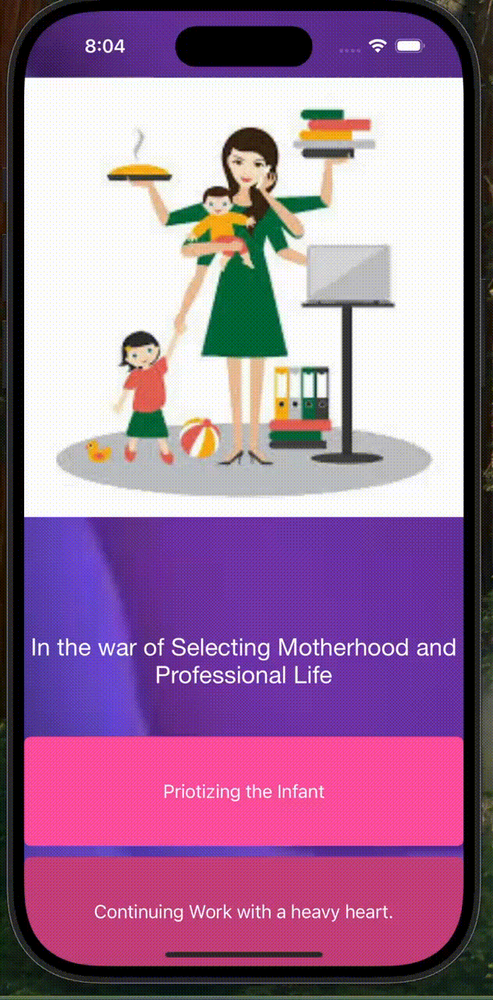
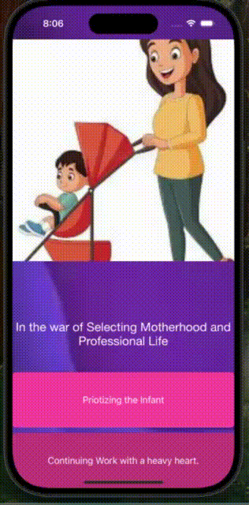

As a Part of Practicing project 
#  Women Destiny

Women Destiny is an iOS application developed in Swift, designed to support women in navigating their paths after motherhood. The app presents users with two choices: to embrace motherhood fully or to continue their career while managing family responsibilities. Based on the user's selection, the app redirects them to tailored content and resources.

Embrace Motherhood: Redirects to resources focused on parenting and family life.
Continue Career: Provides guidance for balancing work and motherhood.
The app utilizes structured navigation with buttons, labels, and images, implementing conditional logic using if-else statements to guide users based on their selections.

>

Here’s a quick demo of how the app works:

Logic learned from Angela
 Complete App Development Bootcamp, check out the full course at [www.appbrewery.co](https://www.appbrewery.co/)

